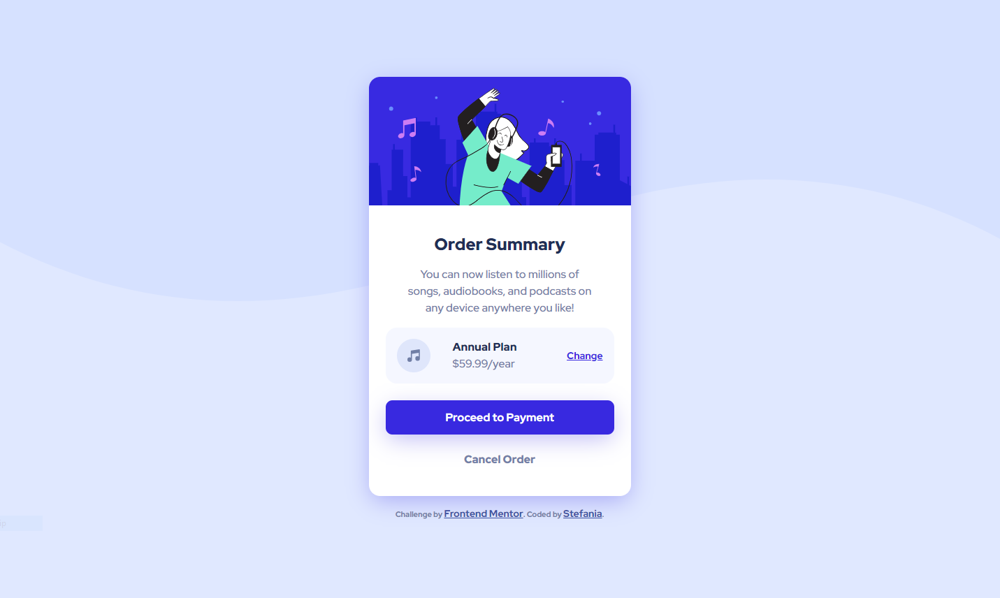

# Frontend Mentor - Order summary card solution

This is a solution to the [Order summary card challenge on Frontend Mentor](https://www.frontendmentor.io/challenges/order-summary-component-QlPmajDUj). Frontend Mentor challenges help you improve your coding skills by building realistic projects. 

## Overview

### The challenge

Users should be able to:

- See hover states for interactive elements

### Screenshot

### Links

[Solution on Frontend Mentor](https://www.frontendmentor.io/solutions/order-summary-solution-AqWF2xjUoU)
[Live Page](https://goat3ggs.github.io/Order-Summary/)